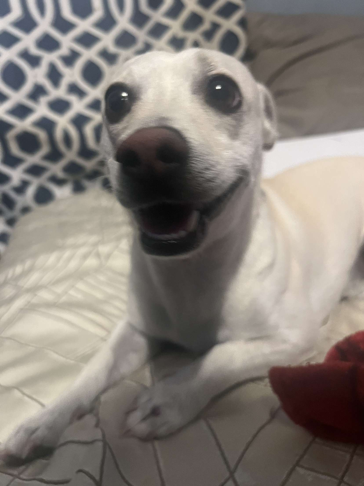

# Aaron Reyes Rodriguez

<h1 align="center">Hi, I'm Aaron Reyes Rodriguez</h1>

  <b>Computer Science Student @ University of Oregon | Full-Stack & Software Developer</b>

  
  
  

---

### About Me

I am a Computer Science student at the University of Oregon (graduating June 2026). My work focuses on full-stack web development, systems optimization, and algorithm design.

* **Education:** B.S. in Computer Science @ University of Oregon (GPA: 3.84)
* **Current Role:** Full Stack Software Engineer at [QuackHacks](https://quackhacks.org/) (Oregon's largest MLH hackathon)
* **Global Experience:** Software Engineering Intern at Almaprism Inc. in Kyoto, Japan
* **Research:** Co-authored a research abstract on pediatric ADHD behavioral metrics that won Best Oral Presentation at the Japan Society for ADHD Annual Conference.

---

### Tech Stack & Skills

| Category | Technologies |
| :--- | :--- |
| **Languages** |        |
| **Frameworks & Libraries** |       |
| **Cloud & DevOps** |     |

---

### Professional Experience

#### **Full Stack Software Engineer** @ [QuackHacks](https://quackhacks.org/)
*February 2025 – Present | Eugene, OR*

#### **Intern Software Developer** @ [Almaprism Inc.](https://almaprism.com/)
*April 2025 – June 2025 | Kyoto, Japan*

---

### Contact & Links

* **Email:** [aaronreyesrodriguez504@gmail.com](mailto:aaronreyesrodriguez504@gmail.com)
* **LinkedIn:** [linkedin.com/in/aaron-reyes-rodriguez-4169a7325](https://linkedin.com/in/aaron-reyes-rodriguez-4169a7325)

---

### Here is a picture of my dog, Max

  

